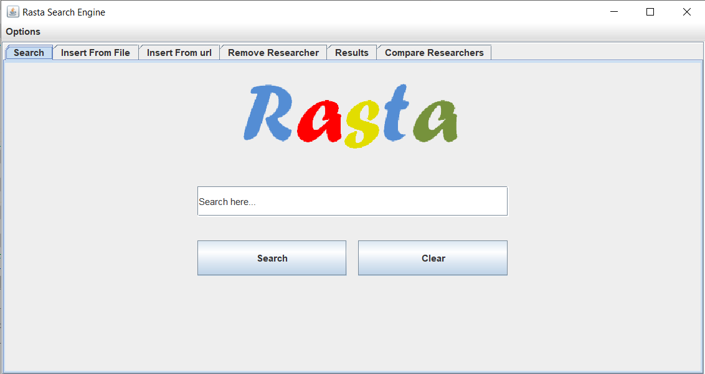

# Rasta Search Engine Java Lucene
 A search engine made using java and Apache Lucene library in Netbeans IDE. It is used to find the most relative keywords in researchers' work. Researchers can be inserted via a txt file in a certain format or via dblp url.

## Rasta Home Page

